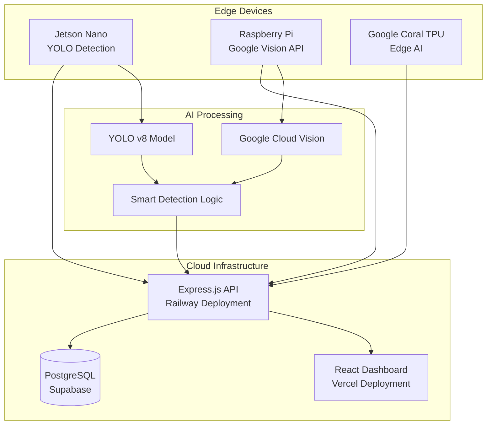

# 🛡️ ARCIS - Autonomous Real-time Critical Infrastructure Security System

<div align="center">


**AI-Powered Weapon Detection Platform**

[](https://nodejs.org/)
[](https://reactjs.org/)
[](https://www.typescriptlang.org/)
[](https://expressjs.com/)
[](https://postgresql.org/)
[](LICENSE)

[🚀 Live Demo](https://arcis-website-kappa.vercel.app/) | [📖 Documentation](All_documentations/) | [🔧 API Docs](backend/server/routes/detection/README.md)

</div>

## 📋 Table of Contents

- [🎯 Project Overview](#-project-overview)
- [✨ Key Features](#-key-features)
- [🏗️ System Architecture](#️-system-architecture)
- [🔧 Technology Stack](#-technology-stack)
- [🚀 Getting Started](#-getting-started)
- [📁 Project Structure](#-project-structure)
- [🌐 Deployment](#-deployment)
- [🧪 Testing](#-testing)
- [📊 Hardware Integration](#-hardware-integration)
- [🔒 Security Features](#-security-features)
- [📈 Performance Monitoring](#-performance-monitoring)
- [🤝 Contributing](#-contributing)
- [📝 License](#-license)

##  Project Overview

**ARCIS (Autonomous Real-time Critical Infrastructure Security System)** is an advanced AI-powered weapon detection platform that revolutionizes security monitoring for critical facilities and public spaces. The system uses cutting-edge computer vision and machine learning technologies to identify threats in real-time through live video feeds from multiple camera sources.

###  Core Mission

ARCIS provides **immediate threat detection and alert capabilities** by:

- Processing live video streams from IoT devices (Jetson Nano, Raspberry Pi)
- Detecting 4 specific weapon types: **Knife**, **Pistol**, **Rifle**, and generic **Weapons**
- Calculating dynamic threat levels (1-10 scale) based on weapon type and confidence
- Delivering instant alerts to security personnel through a comprehensive dashboard
- Maintaining detailed audit trails and detection analytics

###  Target Applications

- **Critical Infrastructure**: Power plants, data centers, government facilities
- **Public Spaces**: Airports, schools, shopping centers, transportation hubs
- **Corporate Security**: Office buildings, manufacturing facilities
- **Event Security**: Conferences, concerts, sporting events

##  Key Features

###  AI-Powered Detection
- **YOLO-based Object Detection** with custom-trained models
- **Google Cloud Vision API** integration for enhanced accuracy
- **Real-time Processing** with sub-second response times
- **Smart Detection Logic** to minimize false positives

###  Intelligent Dashboard
- **Live Threat Monitoring** with real-time status updates
- **Interactive Detection Timeline** with detailed analytics
- **System Metrics Visualization** including device health monitoring
- **Manual Detection Entry** for security personnel
- **Comprehensive Reporting** with exportable data

###  Alert System
- **Automatic Threat Alerts** based on configurable thresholds
- **Multi-level Severity Classification** (Low, Medium, High, Critical)
- **Real-time Notifications** through web interface
- **Alert History** and resolution tracking

###  IoT Integration
- **Multi-device Support** (Jetson Nano, Raspberry Pi, Google Coral TPU)
- **Edge Computing** capabilities for reduced latency
- **Device Health Monitoring** with heartbeat detection
- **Scalable Architecture** supporting multiple concurrent devices

##  System Architecture



###  Data Flow

1. **Capture**: Edge devices capture video frames from cameras
2. **Process**: AI models analyze frames for weapon detection
3. **Filter**: Smart detection logic validates and filters results
4. **Upload**: Verified detections sent to cloud API with metadata
5. **Store**: Detection data and images stored in PostgreSQL database
6. **Alert**: High-threat detections trigger immediate alerts
7. **Display**: Real-time updates pushed to web dashboard

## 🔧 Technology Stack

###  Frontend
- **React 19.0** - Modern UI library with hooks and context
- **TypeScript 5.7** - Type-safe development
- **Chakra UI** - Component library for consistent design
- **Vite** - Fast development build tool
- **React Router** - Client-side routing
- **Axios** - HTTP client for API communication

###  Backend
- **Node.js 18+** - Server runtime environment
- **Express.js 4.18** - Web framework
- **PostgreSQL 15+** - Primary database
- **Supabase** - Database hosting and real-time subscriptions
- **Multer** - File upload handling
- **Socket.IO** - Real-time communication
- **JWT** - Authentication and authorization

###  AI/ML Components
- **YOLO v8** - Object detection model
- **Google Cloud Vision API** - Image analysis service
- **OpenCV** - Computer vision library
- **PyTorch** - Deep learning framework
- **Ultralytics** - YOLO implementation

###  Deployment & Infrastructure
- **Vercel** - Frontend hosting and CDN
- **Railway** - Backend API hosting
- **Supabase** - PostgreSQL database hosting
- **Google Cloud Platform** - Vision API and compute resources

###  Testing & Quality Assurance
- **Jest** - Unit testing framework
- **Cypress** - End-to-end testing
- **Testing Library** - React component testing
- **ESLint** - Code linting and formatting

##  Getting Started

###  Prerequisites

- **Node.js 18+** and **npm 8+**
- **Python 3.8+** (for device scripts)
- **PostgreSQL 15+** (or Supabase account)
- **Git** for version control

###  Installation

#### 1. Clone the Repository
```bash
git clone https://github.com/your-username/ARCIS-website.git
cd ARCIS-website
```

#### 2. Install Root Dependencies
```bash
npm install
```

#### 3. Backend Setup
```bash
cd backend/server
npm install

# Create environment configuration
cp .env.example .env
```

#### 4. Frontend Setup
```bash
cd ../../frontend
npm install
```

###  Environment Configuration

#### Backend Environment (`.env`)
```env
# Database Configuration
DB_HOST=your-supabase-host
DB_NAME=postgres
DB_USER=postgres
DB_PASSWORD=your-supabase-password
DB_PORT=5432

# Supabase Configuration
SUPABASE_URL=https://your-project.supabase.co
SUPABASE_ANON_KEY=your-anon-key

# Server Configuration
PORT=5000
JWT_SECRET=your-jwt-secret-key
NODE_ENV=development

# Security
ARCJET_KEY=your-arcjet-key
```

#### Frontend Environment (`.env`)
```env
# API Configuration
VITE_API_URL=http://localhost:5000
VITE_API_BASE_URL=http://localhost:5000/api

# Firebase Configuration (Optional)
VITE_FIREBASE_API_KEY=your-firebase-api-key
VITE_FIREBASE_AUTH_DOMAIN=your-project.firebaseapp.com
```

###  Database Setup

#### Option 1: Supabase (Recommended)
1. Create account at [supabase.com](https://supabase.com)
2. Create new project with PostgreSQL database
3. Copy connection details to `.env` file
4. Initialize schema:
```bash
cd backend/server
node test/initializeOnly.js
```

#### Option 2: Local PostgreSQL
```bash
# Install PostgreSQL
# Create database
createdb arcis_weapon_detection

# Initialize schema
cd backend/server
node test/initializeOnly.js
```

###  Running the Application

#### Development Mode
```bash
# Terminal 1: Backend API
cd backend/server
npm run dev

# Terminal 2: Frontend Development Server
cd frontend
npm run dev

# Terminal 3: Device Scripts (Optional)
cd jetson_pi_scripts
python3 Jetson_Weapon_Detection_v5.py
```

#### Production Mode
```bash
# Backend
cd backend/server
npm start

# Frontend
cd frontend
npm run build
npm run preview
```

###  Verification

1. **Backend API**: Visit `http://localhost:5000/api/health`
2. **Frontend**: Visit `http://localhost:5173`
3. **Database**: Check connection with `node test/checkDatabase.js`

##  Project Structure

```
ARCIS-website/
├── 📁 frontend/                    # React TypeScript Frontend
│   ├── 📁 src/
│   │   ├── 📁 components/         # Reusable UI components
│   │   │   ├── 📁 dashboard/      # Dashboard-specific components
│   │   │   ├── 📁 debug/          # Development and testing tools
│   │   │   └── 📁 common/         # Shared components
│   │   ├── 📁 pages/              # Route components
│   │   ├── 📁 hooks/              # Custom React hooks
│   │   ├── 📁 api/                # API integration layer
│   │   ├── 📁 types/              # TypeScript type definitions
│   │   └── 📁 utils/              # Utility functions
│   ├── 📁 cypress/                # E2E testing
│   ├── 📁 public/                 # Static assets
│   └── 📄 package.json            # Frontend dependencies
│
├── 📁 backend/                     # Node.js Express Backend
│   └── 📁 server/
│       ├── 📁 routes/             # API route handlers
│       │   └── 📁 detection/      # Modular detection system
│       │       ├── 📁 controllers/    # HTTP request handlers
│       │       ├── 📁 services/       # Business logic layer
│       │       ├── 📄 detectionHelpers.js  # Utility functions
│       │       └── 📄 mappingHelpers.js    # Data transformations
│       ├── 📁 middleware/         # Express middleware
│       ├── 📁 config/             # Configuration files
│       ├── 📁 backend tests/      # Backend testing suite
│       └── 📄 index.js            # Server entry point
│
├── 📁 jetson_pi_scripts/          # IoT Device Scripts
│   ├── 📄 Jetson_Weapon_Detection_v5.py    # Latest Jetson script
│   ├── 📄 Pi4_send_frames_v17.py           # Raspberry Pi script
│   └── 📄 enhanced_server_with_smart_detection.py  # AI server
│
├── 📁 coral/                      # Google Coral TPU Integration
│   ├── 📄 test_coral_tpu_simple.py         # TPU testing
│   └── 📄 GOOGLE_CORAL_TPU_SETUP_GUIDE.md # Setup guide
│
├── 📁 All_documentations/         # Comprehensive Documentation
│   ├── 📄 DEPLOYMENT_GUIDE.md              # Deployment instructions
│   ├── 📄 TESTING_GUIDE.md                 # Testing procedures
│   └── 📄 SMART_DETECTION_LOGIC_GUIDE.md  # AI logic documentation
│
├── 📁 pi-jetson/                  # Device Testing Tools
│   ├── 📄 POSTMAN_TESTING_GUIDE.md        # API testing guide
│   └── 📄 ARCIS_Device_Testing_Collection.postman_collection.json
│
└── 📄 README.md                   # This file
```

### 🗂️ Key Directories Explained

#### 📁 `/frontend/src/components/`
- **`dashboard/`**: Main dashboard components (DetectionsList, ThreatAlerts, SystemMetrics)
- **`debug/`**: Development tools (QuickApiTest, DatabaseTestHook)
- **`common/`**: Shared UI components (modals, forms, navigation)

#### 📁 `/backend/server/routes/detection/`
**Modular Architecture** following SOLID principles:
- **`controllers/`**: HTTP request/response handling (5 specialized controllers)
- **`services/`**: Business logic and data access (3 focused services)
- **`helpers/`**: Utility functions and data transformations

#### 📁 `/jetson_pi_scripts/`
- **Device Integration**: Scripts for Jetson Nano and Raspberry Pi
- **AI Processing**: YOLO model integration and Google Vision API
- **Smart Detection**: Advanced filtering and validation logic

##  Deployment

###  Frontend Deployment (Vercel)

#### Automatic Deployment
1. Connect GitHub repository to Vercel
2. Configure build settings:
   ```json
   {
     "buildCommand": "npm run build",
     "outputDirectory": "dist",
     "framework": "vite"
   }
   ```
3. Set environment variables in Vercel dashboard
4. Deploy automatically on git push

#### Manual Deployment
```bash
cd frontend
npm install -g vercel
npm run build
vercel --prod
```

**Live Frontend**: [https://arcis-website-kappa.vercel.app/](https://arcis-website-kappa.vercel.app/)

###  Backend Deployment (Railway)

#### Automatic Deployment
1. Connect GitHub repository to Railway
2. Railway automatically detects Node.js project
3. Configure environment variables in Railway dashboard
4. Deploy using `railway.json` configuration:
   ```json
   {
     "build": { "builder": "NIXPACKS" },
     "deploy": {
       "startCommand": "npm start",
       "healthcheckPath": "/api/health"
     }
   }
   ```

#### Manual Deployment
```bash
cd backend/server
npm install -g @railway/cli
railway login
railway deploy
```

**Live Backend**: [https://arcis-production.up.railway.app/](https://arcis-production.up.railway.app/)

###  Database Deployment (Supabase)

#### Setup Process
1. Create Supabase project at [supabase.com](https://supabase.com)
2. Configure PostgreSQL database
3. Initialize ARCIS schema:
   ```bash
   cd backend/server
   node test/initializeOnly.js
   ```
4. Configure Row Level Security (RLS) policies
5. Set up real-time subscriptions for live updates

#### Database Features
- **Automatic Backups**: Daily automated backups
- **Real-time Subscriptions**: Live data updates
- **REST API**: Auto-generated API endpoints
- **Dashboard**: Built-in database management interface

### 🔧 Environment Variables

#### Production Environment Setup
```bash
# Vercel (Frontend)
VITE_API_URL=https://arcis-production.up.railway.app
VITE_API_BASE_URL=https://arcis-production.up.railway.app/api

# Railway (Backend)
DB_HOST=db.your-project.supabase.co
DB_PASSWORD=your-production-password
SUPABASE_URL=https://your-project.supabase.co
NODE_ENV=production
PORT=5000
```

##  Testing

### 🔬 Testing Strategy

ARCIS implements a comprehensive testing strategy covering all system layers:

#### **Unit Tests** - Component and Function Level
```bash
# Frontend unit tests (Jest + Testing Library)
cd frontend
npm test                    # Run all tests
npm run test:watch         # Watch mode
npm run test:coverage      # Coverage report
```

#### **Integration Tests** - API and Database
```bash
# Backend integration tests
cd backend/server
node test/runAllTests.js           # Complete test suite
node test/testWeaponDetection.js   # Core detection tests
node test/testDatabase.js          # Database operations
node test/testServer.js            # API endpoints
```

#### **End-to-End Tests** - Full User Workflows
```bash
# Cypress E2E tests
cd frontend
npm run cypress:open       # Interactive mode
npm run cypress:run        # Headless mode
npm run e2e                # Full E2E suite
```

###  Test Coverage

#### **Backend Tests** (`backend/server/backend tests/`)
- ✅ **Database Operations**: Connection, schema, CRUD operations
- ✅ **Weapon Detection**: All 4 weapon types (Knife, Pistol, Rifle, Weapon)
- ✅ **Threat Calculation**: Dynamic threat level algorithms
- ✅ **Alert System**: Automatic alert creation and management
- ✅ **API Endpoints**: All REST endpoints with validation
- ✅ **File Upload**: Image processing and storage
- ✅ **Device Integration**: Jetson Nano and Raspberry Pi endpoints

#### **Frontend Tests** (`frontend/cypress/`)
- ✅ **Dashboard Navigation**: All page routes and components
- ✅ **Detection Display**: Real-time detection visualization
- ✅ **Modal Interactions**: Detection details and system metrics
- ✅ **Manual Entry**: Security personnel detection input
- ✅ **Responsive Design**: Mobile and desktop layouts
- ✅ **Error Handling**: Network failures and edge cases

#### **Device Tests** (`pi-jetson/`)
- ✅ **Hardware Integration**: Camera capture and processing
- ✅ **AI Model Performance**: YOLO and Google Vision accuracy
- ✅ **Network Communication**: API upload and error handling
- ✅ **Smart Detection Logic**: False positive reduction
- ✅ **System Metrics**: Performance monitoring and health checks

###  Running Tests

#### **Quick Test Suite**
```bash
# Run core functionality tests
npm run test:quick

# Test specific components
npm run test:detection     # Detection system only
npm run test:api          # API endpoints only
npm run test:ui           # Frontend components only
```

#### **Comprehensive Testing**
```bash
# Full test suite (all layers)
npm run test:full

# Performance and load testing
npm run test:performance

# Security and vulnerability testing
npm run test:security
```

#### **Device Testing**
```bash
# Test device integration
cd pi-jetson
python3 test_device_integration.py

# Test AI model accuracy
python3 test_model_performance.py
```

###  Test Reports

Tests generate detailed reports including:
- **Coverage Reports**: Code coverage percentages
- **Performance Metrics**: Response times and throughput
- **Security Scans**: Vulnerability assessments
- **Device Logs**: Hardware performance and error logs

##  Hardware Integration

###  Supported IoT Devices

#### **NVIDIA Jetson Nano**
- **Primary Use**: Edge AI processing with YOLO models
- **Capabilities**: Real-time object detection, GPU acceleration
- **Setup**: [Jetson Setup Guide](jetson_pi_scripts/README.md)
- **Script**: `Jetson_Weapon_Detection_v5.py`

```python
# Key Features
- YOLO v8 model inference
- CUDA GPU acceleration
- Smart detection filtering
- WebSocket communication
- Automatic reconnection
```

#### **Raspberry Pi 4**
- **Primary Use**: Google Cloud Vision API integration
- **Capabilities**: Cloud-based image analysis, IoT sensor integration
- **Setup**: [Pi4 Setup Guide](All_documentations/PI4_SMART_DETECTION_SETUP.md)
- **Script**: `Pi4_send_frames_v17.py`

```python
# Key Features
- Google Cloud Vision API
- High-resolution image capture
- GPS integration (optional)
- Redis caching
- Network resilience
```

#### **Google Coral TPU**
- **Primary Use**: Ultra-low latency edge inference
- **Capabilities**: Specialized AI acceleration, power efficiency
- **Setup**: [Coral Setup Guide](coral/GOOGLE_CORAL_TPU_SETUP_GUIDE.md)
- **Script**: `test_coral_tpu_simple.py`

### 🔧 Device Configuration

#### **Network Setup**
```bash
# Configure device networking
sudo nano /etc/wpa_supplicant/wpa_supplicant.conf

# Set static IP (recommended)
sudo nano /etc/dhcpcd.conf
```

#### **API Integration**
```python
# Device configuration
ARCIS_CONFIG = {
    'api_url': 'https://arcis-production.up.railway.app',
    'api_key': 'your-device-api-key',
    'device_id': 'unique-device-identifier',
    'upload_interval': 1.0,  # seconds
    'confidence_threshold': 0.5
}
```

#### **Performance Optimization**
```python
# Jetson Nano optimization
sudo nvpmodel -m 0  # Maximum performance mode
sudo jetson_clocks   # Enable maximum clocks

# Raspberry Pi optimization
sudo raspi-config   # Enable camera, GPU memory split
```

###  Communication Protocol

#### **Data Upload Format**
```json
{
  "device_id": "jetson_nano_01",
  "timestamp": "2024-01-15T10:30:00Z",
  "detections": [{
    "object_type": "Pistol",
    "confidence": 0.87,
    "bounding_box": [100, 150, 200, 250],
    "threat_level": 8
  }],
  "system_metrics": {
    "cpu_usage": 45,
    "gpu_usage": 60,
    "memory_usage": 55,
    "temperature": 65
  }
}
```

##  Security Features

###  Authentication & Authorization
- **JWT-based Authentication**: Secure token-based user sessions
- **Role-based Access Control**: Different permission levels for users
- **API Key Validation**: Device authentication for IoT endpoints
- **Session Management**: Automatic token refresh and logout

###  Data Protection
- **Encrypted Communications**: HTTPS/WSS for all data transmission
- **Database Encryption**: Encrypted data at rest in PostgreSQL
- **Image Security**: Secure binary storage with access controls
- **Environment Variables**: Sensitive configuration protected

###  Security Middleware
- **Rate Limiting**: Prevent API abuse and DoS attacks
- **CORS Protection**: Cross-origin request security
- **Helmet.js**: Security headers and vulnerability protection
- **Input Validation**: Comprehensive request validation and sanitization

###  Monitoring & Auditing
- **Access Logging**: Detailed logs of all system access
- **Detection Audit Trail**: Complete history of all detections
- **Error Tracking**: Comprehensive error logging and alerting
- **Performance Monitoring**: System health and performance metrics

##  Performance Monitoring

###  System Metrics Dashboard
- **Real-time Performance**: Live CPU, GPU, memory, and network usage
- **Detection Analytics**: Processing times, accuracy rates, alert frequency
- **Device Health**: IoT device status, connectivity, and performance
- **Database Performance**: Query times, connection pooling, storage usage

###  Key Performance Indicators (KPIs)
- **Detection Latency**: < 500ms from capture to alert
- **System Uptime**: 99.9% availability target
- **Accuracy Rate**: > 95% true positive detection rate
- **False Positive Rate**: < 2% false alarm rate

###  Monitoring Tools
- **Built-in Metrics**: Native performance monitoring
- **Health Check Endpoints**: `/api/health` for system status
- **Log Aggregation**: Centralized logging with structured data
- **Alert Thresholds**: Configurable performance alerts

##  Contributing

###  Development Workflow

1. **Fork the Repository**
   ```bash
   git clone https://github.com/your-username/ARCIS-website.git
   cd ARCIS-website
   ```

2. **Create Feature Branch**
   ```bash
   git checkout -b feature/your-feature-name
   ```

3. **Development Setup**
   ```bash
   npm install
   cd backend/server && npm install
   cd ../../frontend && npm install
   ```

4. **Make Changes**
   - Follow existing code patterns
   - Add tests for new functionality
   - Update documentation as needed

5. **Test Your Changes**
   ```bash
   npm run test:full
   npm run lint
   ```

6. **Submit Pull Request**
   - Provide clear description of changes
   - Include test results and screenshots
   - Reference related issues

###  Development Guidelines

#### **Code Standards**
- **TypeScript**: Use strict typing for all new code
- **ESLint**: Follow configured linting rules
- **Prettier**: Consistent code formatting
- **Comments**: Document complex logic and public APIs

#### **Testing Requirements**
- **Unit Tests**: Required for all new functions/components
- **Integration Tests**: Required for new API endpoints
- **E2E Tests**: Required for new user workflows

#### **Documentation**
- **README Updates**: Update relevant documentation
- **Code Comments**: JSDoc for public APIs
- **Change Log**: Document breaking changes

###  Bug Reports

When reporting bugs, please include:
- **Environment Details**: OS, Node.js version, browser
- **Steps to Reproduce**: Clear reproduction steps
- **Expected Behavior**: What should happen
- **Actual Behavior**: What actually happens
- **Screenshots/Logs**: Visual evidence and error logs

##  License

This project is licensed under the **ISC License** - see the [LICENSE](LICENSE) file for details.

###  License Summary
- ✅ **Commercial Use**: Permitted
- ✅ **Modification**: Permitted
- ✅ **Distribution**: Permitted
- ✅ **Private Use**: Permitted
- ❗ **Liability**: Limited
- ❗ **Warranty**: None provided

---

##  Acknowledgments

###  Technologies Used
- **[YOLO](https://ultralytics.com/)** - Object detection framework
- **[Google Cloud Vision](https://cloud.google.com/vision)** - Image analysis API
- **[Supabase](https://supabase.com/)** - Database and backend services
- **[Vercel](https://vercel.com/)** - Frontend hosting platform
- **[Railway](https://railway.app/)** - Backend deployment platform

###  AI Models
- **Custom YOLO Models** - Trained for weapon detection
- **Google Cloud Vision** - Pre-trained image classification
- **TensorFlow Lite** - Mobile and edge deployment

###  Development Tools
- **React Developer Tools** - Frontend debugging
- **Postman** - API testing and documentation
- **Cypress** - End-to-end testing framework

---

<div align="center">

**Built with  for Enhanced Security and Public Safety**

[🔗 Project Website](https://arcis-website-kappa.vercel.app/) | [📧 Contact](mailto:support@arcis-system.com) | [🐛 Report Issues](https://github.com/your-username/ARCIS-website/issues)

</div>
